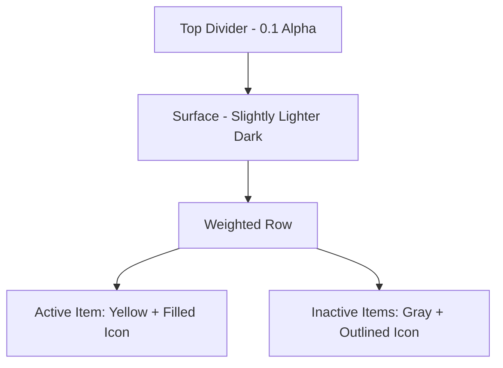
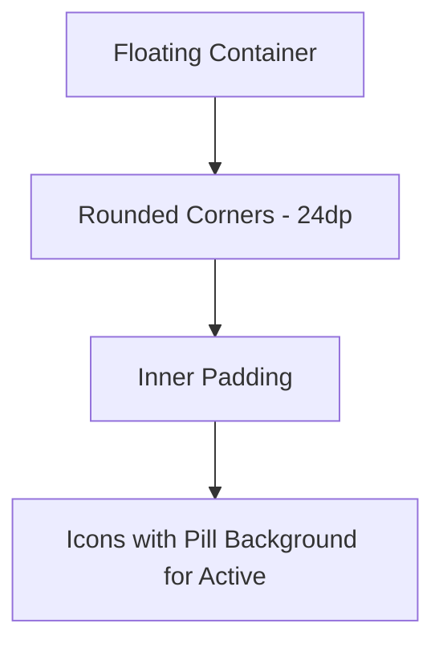

# Discussion: Aesthetic Improvements for BottomNavigation

Based on the `HomeScreenPreview`, the current `BottomNavigation` is functional but lacks the "premium" feel of modern apps. Here are several suggestions to improve its aesthetics and usability.

## 1. Layout Refinement (HomeScreen.kt)
Currently, the `BottomNavigation` sits at the end of a `Column`. If the activity list grows, it might push the navigation bar off-screen.
- **Suggestion**: Give the `LazyColumn` in `HomeScreen` a `Modifier.weight(1f)`. This will push the `BottomNavigation` to the very bottom and keep it "sticky" while the content scrolls behind it.

## 2. Visual Separation
The `HorizontalDivider` is a good start, but in a dark theme, we can do more:
- **Gradient Border**: Use a very subtle top-to-bottom gradient or a 1dp line with a slight glow.
- **Elevation vs. Surface**: Instead of standard elevation (which is hard to see on black), use a slightly lighter surface color (e.g., `#2A2520`) to distinguish the bar from the `RunBackground`.

## 3. Active State (Crucial for UX)
A navigation bar should clearly show where the user is.
- **Color Coding**: Use `RunYellow` (your accent color) for the active icon and `Color.Gray` for inactive ones.
- **Indicator**: Add a small "active indicator" (like a pill-shaped background or a dot below the icon).
- **Filled vs. Outlined**: Use Filled icons for the active state and Outlined for others (e.g., `Icons.Filled.House` vs `Icons.Outlined.House`).

## 4. Interaction & Feedback
- **Clickable Area**: Ensure the `IconButton` occupies the full height of the bar.
- **Haptics**: (Optional) Add subtle haptic feedback on tab change.

## 5. Modern "Floating" Look (Alternative)
Instead of a full-width bar, we could implement a "Floating Bottom Nav":
- Rounded corners on all sides.
- Small horizontal margins (e.g., `16.dp`).
- This makes the UI feel more modular and modern.

---

### Proposed Concept (Standard Stick)

### Proposed Concept (Floating)

**Which direction would you like to explore?** I can help you implement a specific state-aware navigation or a more stylized "floating" version.
